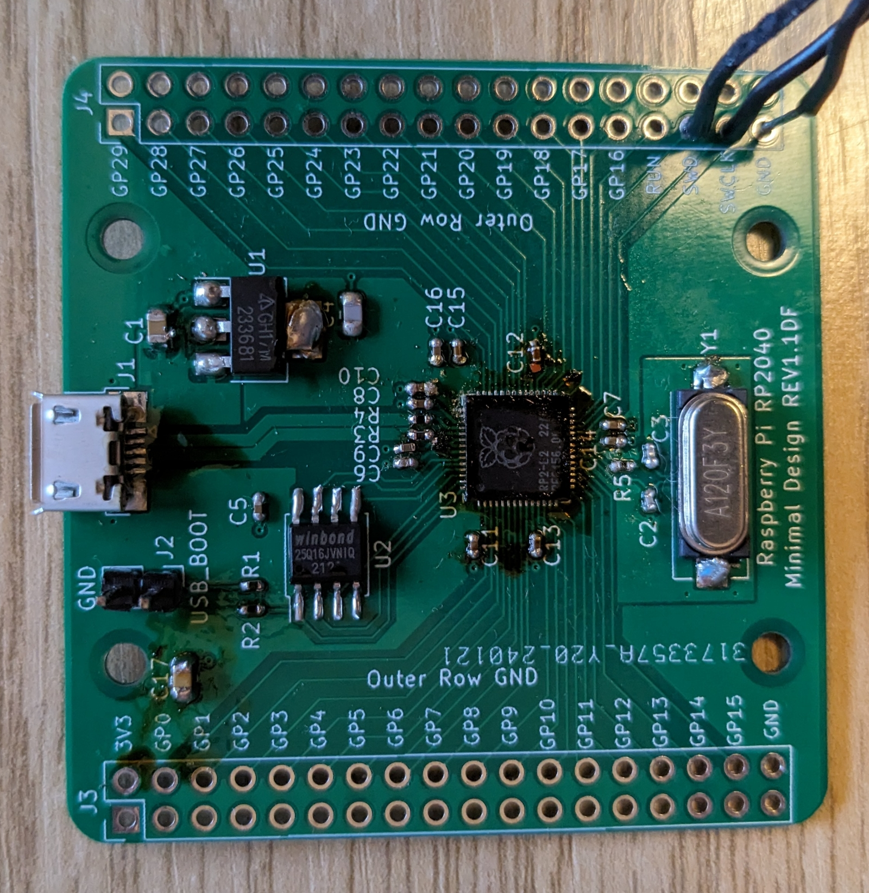

# RP2040 Minimal Circuit (Failure)

This is the RP2040 minimal circuit, as linked to from the RP2040
hardware guide. I thought I'd have a go at making it, just to see if
I could.

Spoiler: I couldn't.

## Adaptions

I couldn't find the NCP1117 voltage regulator, so I switched it for
the AZ1117. That's essentially the same device, only it needs a
slightly different value for one of the capacitors.

I also changed their 16MB flash for a 2MB one, which was much
cheaper and adequate for my purposes.

I labelled the revised board v1.1DF and had it made up by JLCPCB.

## Soldering 0402

The 0402 sized components are very fiddly, but not really any
different to the bigger ones. I couldn't use my preferred 3mm iron
tip, I used a 1mm conical one with the iron temperature turned up
to about 335C. I still don't find it easy to get heat into the joint
but it does work. Some components are so close to each other it's
hard to get the tweezer tips in the gaps.

I pulled a pad off the board at C12. They're a lot more fragile than
bigger pads. C12 is only one of many decoupling capactitors, so I
figured I could get away with this one missing.

After soldering those, the joints are greatly improved with a 1 minute
blast of 230C air with a small nozzle, just to melt and reseal the
surface of the solder. That removes the icicles, and any joints that
are dangerously close to each other change into smooth round blobs
which makes inspection much easier.

## Soldering RP2040

The RP2040 was beyond me. My best approach was to use liquid flux on
the pads, then wipe a tinned soldering iron along each pad to wet it.
Then use the hot air again to ensure each pad's tinning was neat.
Getting just the right amount of solder on the ground pad was very
hard. Too little, no joint; too much and the IC sits up proud when
trying to solder it and the air gets underneath. I put some solder on
then wicked off almost all of it with solder braid.  Again, the hot
air evens its up nicely.

For hot air soldering I tried to use a profile like the RP2040 oven
profile. I put the station on 260C, then did:

* 90 seconds at 200C, so I kept the gun some distance away
* 30 seconds at 220C, moving the gun to within 2cm
* 30 seconds at 260C, moving the gun to within 1cm
* 45 seconds slowly bringing the gun away

It's all rather hand-wavy. I've no way of knowing what temperatures
the IC is getting to.

I found wiping a small amount of flux along each side before starting
made the solder apparently melt a little easier, but it's hard to tell.

Keeping the air coming from directly above, the RP2040 solders on
correctly using this approach, and as far as I can see under
magnification it should work, but it doesn't. I must have added and
removed the RP2040 half a dozen times, but I never got one working.
I can probe 3V3 at the IC's power input, but there's nothing on the
crystal driver output, nothing on the SWD, and the USB doesn't work.

## Failure

Maybe there's a better technique, or maybe I'm cooking the IC. I've
no way to tell. I hate giving up, but this was becoming pointless.
If my experience helps anyone else, well, there's that I suppose.

Derek Fountain, February 2024